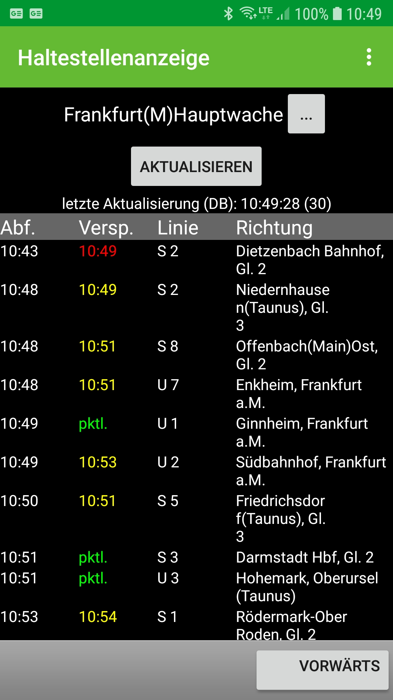

# Haltestellenanzeige (Android-App)

Anzeigemonitor für alle Haltestellen/Bahnhöfe in Deutschland

Diese App ist für Pendler gedacht, die jeden Tag die gleichen Haltestellen benutzen.

Für jede Haltestelle kann ein Abfahrtsmonitor erstellt werden, entweder in der App selber oder durch Widgets.

Es werden alle Haltestellen in Deutschland unterstützt, teilweise mit Verspätungsinformationen.

Goolge Play Store:
https://play.google.com/store/apps/details?id=org.sge.haltestellenanzeige

[english]
Android App, that displays the departure times of all stops in Germany.

This app is intended for commuters who use the same stops every day.

A departure monitor can be created for each stop, either in the app itself or through widgets.

All stops in Germany are supported, some with delay information.

